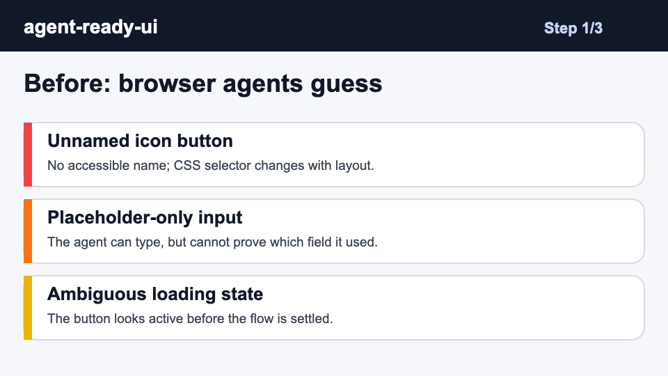

# agent-ready-ui

Make web UIs controllable by browser agents without brittle selectors.




A drop-in **skill** using the open [agentskills.io](https://agentskills.io)
standard. It works in **both Claude Code and Codex** and gives coding agents a
repeatable workflow for adding the labels, states, and locator contracts browser
agents need to click, type, wait, and verify reliably.

## Install

### Claude Code

```bash
git clone https://github.com/omidsaffari/agent-ready-ui ~/.claude/skills/agent-ready-ui
```

Then it auto-triggers on a matching task, or invoke it with `/agent-ready-ui`.

### Codex

```bash
git clone https://github.com/omidsaffari/agent-ready-ui ~/.agents/skills/agent-ready-ui
```

Then invoke with `$agent-ready-ui`, or let Codex pick it implicitly.

## What it does

- Maps every browser-agent action to a stable role/name, label, state, and
  success signal.
- Finds controls that break automation: unnamed icon buttons, duplicate labels,
  placeholder-only fields, ambiguous dialogs, unstable loading states, and
  custom menus without roles.
- Guides minimal UI patches that improve both human semantics and browser-agent
  reliability.
- Verifies the flow with role/name locators and observable settled states instead
  of CSS selectors or arbitrary sleeps.

## Before And After

`agent-ready-ui` turns brittle automation targets into user-facing contracts.

```ts
// before: layout-coupled and easy to break
await page.locator('.modal > div:nth-child(2) button').click();

// after: scoped to the dialog and readable by humans and agents
await page
  .getByRole('dialog', { name: 'Payment method' })
  .getByRole('button', { name: 'Save card' })
  .click();
```

The skill produces an action map like this:

| Step | User action | Preferred locator | Required state | Success signal |
| --- | --- | --- | --- | --- |
| 1 | Open checkout | `getByRole('button', { name: 'Checkout' })` | visible, enabled | URL contains `/checkout` |
| 2 | Save card | `dialog.getByRole('button', { name: 'Save card' })` | dialog visible, button enabled | Toast says `Card saved` |

See the full [checkout before/after example](examples/checkout-before-after.md).

## Use it for

- Making a signup, checkout, onboarding, or admin flow reliable for Playwright or
  browser-control agents.
- Preparing a web app for GUI agents such as page agents, Claude Computer Use, or
  Codex browser tasks.
- Tightening a component library so future automation can locate controls by
  role/name before falling back to test ids.

## How it works

The skill starts by reading the repo's frontend conventions, then builds an
action map for the target flow. It patches only affordances: labels, roles,
state, scoped names, deterministic loading behavior, and existing test-id
patterns when accessible locators are not enough. [SKILL.md](SKILL.md) is the
source of truth.

Use the reference docs when applying the skill to a real app:

- [Agent action map](references/agent-action-map.md)
- [ARIA patterns](references/aria-patterns.md)
- [Playwright locators](references/playwright-locators.md)

## Example prompt

```text
Use agent-ready-ui on the checkout flow so a browser agent can add a card,
submit payment, and confirm the receipt without brittle selectors.
```

## Changelog

See [CHANGELOG.md](CHANGELOG.md).

## License

MIT — see [LICENSE](LICENSE). Built by [Omid Saffari](https://omidsaffari.com).
